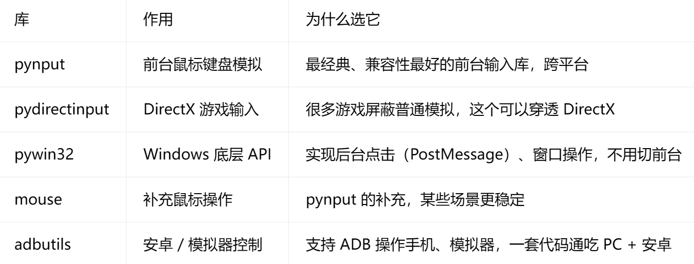
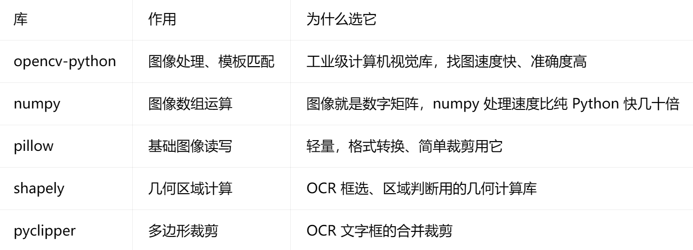
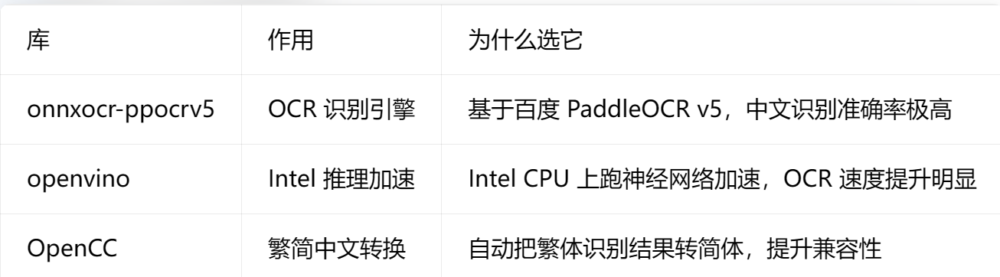
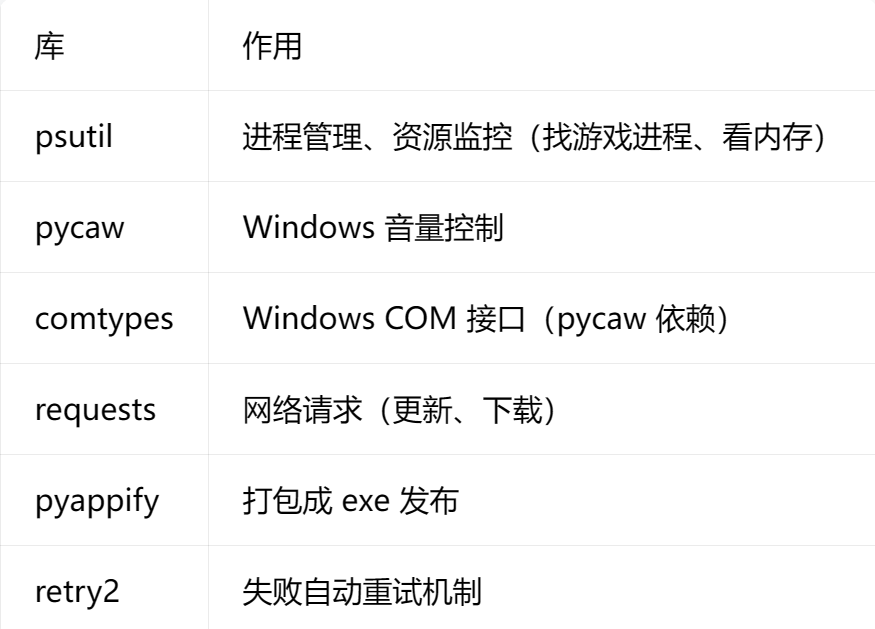

每一份py文件的开头都要记得

```python
# ========== 全局初始化（解决Windows缩放偏移） ==========
ctypes.windll.user32.SetProcessDpiAwarenessContext(-4)
pyautogui.PAUSE = 0.2  # 操作间隔，防操作过快

# ========== 配置项 ==========
IMG_CONFIDENCE = 0.8
RETRY_DELAY = 1
MAX_RETRY = 30  # 不建议无限重试
```

记得把句柄的获取放在外面保存

`hwnd = function.get_target_window_hwnd(window_keyword)`

目前写的都是针对于全屏，小窗的话应对方案的焦点加移动窗口到左上角

针对于打包有如下操作以保证能够被正确封装

auto-py-to-exe

选择附加的文件

打包成单个文件

# 图片文件与代码调用的关系说明

在 KACHA AUTO 项目中，**图片文件、Python 脚本、打包程序**三者的调用关系，本质上是「路径解析规则」在不同运行环境下的差异导致的，我们分三层讲清楚：

---

## 一、基础逻辑：本地开发环境中的调用关系

在你的项目目录 `D:\Project_Dev\KACHA_AUTO\` 中，结构如下：

```
项目根目录/
├─ main.py              # 主程序
├─ NikkeAuto.py         # 子脚本
├─ function.py          # 工具模块
├─ nte_img/             # 图片文件夹
│  └─ image.png         # 被调用的图片文件
```

1. **代码写法**：脚本中通过相对路径调用图片
   ```python
   # 以 NikkeAuto.py 为例
   function.click_pic("nte_img/image.png")
   ```
2. **本地运行时的解析规则**：
   - Python 会以「当前工作目录」为基准，拼接相对路径。
   - 你在项目目录下运行脚本时，当前工作目录就是 `D:\Project_Dev\KACHA_AUTO\`。
   - 因此 `nte_img/image.png` 会被解析为 `D:\Project_Dev\KACHA_AUTO\nte_img\image.png`，路径完全匹配，图片可正常读取。

---

## 二、打包为 One Directory（文件夹模式）时的调用关系

使用 Auto Py to Exe 打包为文件夹模式后，目录结构会复制你的开发环境：

```
output/main/            # 打包后的输出目录
├─ main.exe             # 可执行文件
├─ nte_img/             # 复制过来的图片文件夹
│  └─ image.png
├─ ark_img/
└─ ...
```

1. **打包配置要求**：
   必须在 `Additional Files` 中添加所有图片文件夹，**源路径与目标路径保持一致**（如 `D:\Project_Dev\KACHA_AUTO\nte_img` → `nte_img/`）。
2. **运行时的解析规则**：
   - 程序运行时，当前工作目录是 `output/main/`（即 `main.exe` 所在目录）。
   - 代码中的相对路径 `nte_img/image.png` 会被解析为 `output/main/nte_img/image.png`，和文件实际位置完全匹配，因此可正常读取。
3. **结论**：文件夹模式下，调用关系与开发环境完全一致，无需修改代码。

---

## 三、打包为 One File（单文件模式）时的调用关系

单文件模式下，`main.exe` 运行时会做两件事：

1. 把所有文件解压到系统临时目录（如 `C:\Users\XXX\AppData\Local\Temp\_MEIXXXX`）。
2. 程序的「当前工作目录」仍是 `main.exe` 所在的目录，而不是临时解压目录。

此时就出现了**路径不匹配**的问题：

- 图片文件实际解压到：`C:\Users\XXX\AppData\Local\Temp\_MEIXXXX\nte_img\image.png`
- 代码中的相对路径会被解析为：`main.exe 所在目录\nte_img\image.png`
- 这两个路径不一致，导致程序找不到文件，抛出 `Failed to read nte_img\image.png` 错误。

---

## 四、解决单文件模式路径问题的核心方法

如果要使用单文件模式，必须修改代码，让程序动态获取临时解压目录的路径：

```python
import os
import sys

# 定义全局路径基址
if getattr(sys, 'frozen', False):
    # 单文件模式：使用临时解压目录作为基址
    BASE_DIR = sys._MEIPASS
else:
    # 开发/文件夹模式：使用当前脚本目录作为基址
    BASE_DIR = os.path.dirname(os.path.abspath(__file__))

# 拼接图片的绝对路径
img_path = os.path.join(BASE_DIR, "nte_img", "image.png")
function.click_pic(img_path)
```

这样修改后，无论在哪种模式下，`img_path` 都会指向图片的实际位置，调用关系保持一致。

---

这里我选择了修改function的函数


一、文档概述
本文档旨在说明 KACHA AUTO 项目中图片资源文件与 Python 代码调用之间的关系，分析不同运行环境下的路径解析规则，以及打包过程中遇到的路径问题及解决方案，为后续开发与打包提供标准化指导。
二、项目背景
KACHA AUTO 是一款基于 Python 的游戏自动化工具集，采用 Tkinter 构建图形界面，通过图像识别与键鼠模拟实现游戏自动化操作。项目包含多个游戏脚本模块，依赖大量图片资源文件作为图像识别的模板。
项目核心结构：

- main.py：主程序入口，提供图形界面与脚本调度
- NikkeAuto.py / ArkAuto.py / FgoAuto.py 等：各游戏自动化脚本
- function.py：通用工具函数模块（窗口控制、图像识别、路径管理等）
- nte_img/ / ark_img/ / fgo_img/ 等：各游戏对应的图片资源文件夹
  三、图片资源与代码调用关系
  3.1 本地开发环境
  在本地开发环境中，所有 Python 脚本与图片文件夹位于同一项目根目录下，代码通过相对路径引用图片资源。
  目录结构：
  D:\Project_Dev\KACHA_AUTO
  ├─ main.py
  ├─ NikkeAuto.py
  ├─ function.py
  ├─ nte_img/
  │  └─ image.png
  ├─ ark_img/
  └─ ...

代码调用方式：

# 脚本中通过相对路径调用图片

function.click_pic("nte_img/image.png")

路径解析规则：
Python 以「当前工作目录」为基准拼接相对路径。在项目目录下运行脚本时，当前工作目录即为项目根目录，因此 nte_img/image.png 会被解析为 D:\Project_Dev\KACHA_AUTO\nte_img\image.png，路径完全匹配，图片可正常读取。


一、整体说明
本项目区别于通用型桌面自动化工具，针对PC 游戏场景深度定制，从输入模拟、窗口控制、逻辑校验、异常容错、工程化发布等多维度做了专项优化，解决了常规自动化工具在游戏环境中兼容性差、定位不准、稳定性弱、部署繁琐等痛点，形成独有技术优势。
二、分项技术优势详解

1. 基于 pydirectinput 的 DirectX 穿透式前台输入
   技术实现
   采用 pydirectinput 作为键鼠模拟核心库，依托 DirectX 协议实现前台真实键鼠点击，区别于 pyautogui 等常规模拟库。
   核心能力
   穿透游戏防护：主流虚幻引擎、DX 架构游戏会屏蔽普通键鼠模拟指令，本方案可绕过限制，完成有效点击、按键、移动等操作；
   纯前台模拟：仅依赖前台窗口交互，适配绝大多数网游、单机游戏运行规则；
   高兼容性：属于行业经典前台输入方案，具备跨平台特性，适配不同版本 Windows 系统。
   业务价值
   彻底解决「普通自动化工具在游戏内点击无效、指令被拦截」的核心问题，大幅拓宽支持游戏范围。
2. 精细化窗口管理 + 坐标 / 图像定位优化
   技术实现
   结合 Windows 窗口句柄（HWND）完成全生命周期窗口控制，配套坐标矫正、区域图像检索逻辑：
   通过窗口标题精准匹配游戏窗口句柄，实现窗口置顶、前置、层级调整、位置对齐等操作；
   内置 DPI 感知适配代码，彻底解决 Windows 系统缩放导致的坐标偏移问题；
   限制图像识别检索范围：仅在目标游戏窗口内执行图片查找，而非全屏检索。
   核心能力
   窗口锁定：保证自动化操作始终作用于目标游戏窗口，避免误操作；
   坐标精准：适配系统缩放、窗口大小变化，点击坐标零偏移；
   效率提升：局部图像检索缩小扫描范围，加快识图速度；
   准确率提升：排除桌面其他元素干扰，降低图片识别误判概率。
   业务价值
   从底层保证自动化操作的精准性，是长周期、无人值守自动化运行的基础保障。
3. 二次校验 + 回返验证机制，提升程序鲁棒性
   技术实现
   自定义分步校验逻辑：执行单步自动化操作后，不会直接进入下一步，而是主动校验后续操作的前置条件是否达成（通过图像识别、窗口状态等方式验证）；若条件不满足，执行回退、重试或异常提示。
   核心能力
   打破「顺序执行、盲目运行」的传统自动化逻辑，形成执行 - 校验 - 分支处理的闭环流程。
   业务价值
   有效应对游戏加载延迟、网络卡顿、界面跳转异常等突发场景，减少程序卡死、操作错乱问题，大幅提升整体稳定性与容错能力。
4. 基于 psutil 的进程管理与系统资源监控
   技术实现
   集成 psutil 系统进程库，拓展进程级管控能力：
   精准检索游戏进程，辅助窗口匹配、进程状态判断；
   实时监控进程内存、CPU 占用等系统资源。
   核心能力
   支持进程查找、状态检测、资源占用监控，可拓展实现进程唤醒、异常进程关闭等功能。
   业务价值
   实现「窗口 + 进程」双重状态判定，进一步强化程序对游戏运行状态的感知能力，便于异常诊断与运维。
5. 自动化打包发布：pyautoinstall + auto-py-to-exe
   技术实现
   搭配 auto-py-to-exe（基于 PyInstaller）完成项目打包，结合 pyautoinstall 实现程序简易部署。
   核心能力
   支持文件夹模式、单文件模式两种打包方案，适配不同分发场景；
   一键将 Python 源码编译为独立 EXE 可执行文件，脱离本地 Python 环境运行；
   简化安装、部署流程，降低终端用户使用门槛。
   业务价值
   实现项目工程化交付，源码与运行环境解耦，支持快速对外分发、部署使用。
6. 基于 retry2 的自动失败重试机制
   技术实现
   引入 retry2 重试组件，为图像识别、键鼠操作、窗口绑定等易失败环节配置自动重试策略，可自定义重试次数、重试间隔。
   核心能力
   针对瞬时网络波动、游戏画面加载延迟、识图偶发失败等临时问题，自动重试执行，无需人工干预。
   业务价值
   减少偶发故障导致的程序中断，提升无人值守场景下的运行成功率。
7. 通用工具函数封装，模块化开发提效
   技术实现
   将窗口操作、图像识别、路径处理、弹窗提示、文件读写、配置读写等高频通用逻辑，统一封装为独立公共函数（function.py）。
   核心能力
   代码复用：所有游戏自动化脚本可直接调用公共函数，重复代码零冗余；
   统一标准：全项目使用同一套底层能力，降低多脚本维护成本；
   快速开发：新游戏脚本开发时，仅需编写业务逻辑，无需重复搭建底层能力。
   业务价值
   规范项目代码结构，缩短新功能、新脚本的开发周期，降低后期迭代与维护成本。
   三、优势总结
   本项目并非简单的脚本拼接，而是面向游戏自动化场景的一体化解决方案：
   兼容性强：基于 DirectX 输入方案，适配主流虚幻引擎、DX 类游戏，解决常规工具输入被拦截问题；
   定位精准：窗口句柄管控 + DPI 矫正 + 局部识图，彻底解决坐标偏移、识别干扰问题；
   稳定性高：重试机制、二次校验、进程监控多层容错，适配复杂游戏运行场景；
   工程化完善：模块化封装、一键打包发布，兼顾开发效率与终端部署体验；
   可拓展性强：底层能力全部通用化，可快速新增多款游戏自动化脚本。
